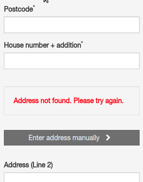

# NL Address Filler

## About

> NOTE: this module is for Dutch addresses only

Auto fill the streetname and city field when the postcode + number are known and speed up the checkout process.

### Installing the module

> NOTE: this module has been designed for the community default theme. Other themes will require some work.

Install the module via your thirty bees back office. Most of the configuration options are plug and play.
